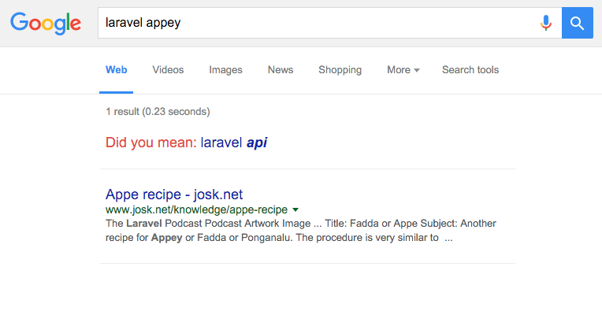

Day 1! I've managed to squeeze in 1 hour of development time this
evening, in which I've completed the following:

  - Setup the Lumen framework
  - Configure Vagrant with Ubuntu and nginx
  - Write and import the first set of database migrations
  - I've now set up
    [a public Github repository](https://github.com/gpmcadam/bloon)
    to track the project

Fairly productive hour; looking forward to working on seeding the database
and hopefully starting on the UI in the next couple of days. I'm eager to
try out Browsersync, since seeing
[a cool demo of it](https://www.youtube.com/watch?v=heNWfzc7ufQ) yesterday.

## Today's Observations

 - It took me a while to get used to the small differences between Lumen
   and Laravel. Mainly the lack of some
   [**artisan**](http://laravel.com/docs/5.1/artisan) commands that I've
   grown used to (such as `key:generate` and `tinker`), and also that
   certain aspects of the framework are disabled by default, including DotEnv,
   and have to be enabled manually in `bootsrap/app.php`
 - In my Googling today, a typo lead me to a genuine
   [Googlewhack!]("https://en.wikipedia.org/wiki/Googlewhack")
   
 - Stats for today: 5 commits, time spent 1h 5m 10s
