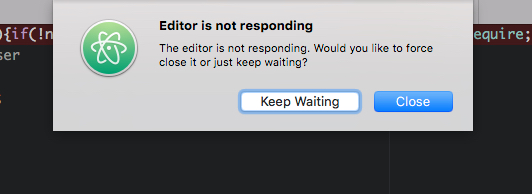

Day 2, and I've spent 4 hours this evening just fighting to get
ReactJS to compile to ES5. Maybe I can just skip the next 3 days
to compensate?

    

That's how I feel right now, anyway.

I'm a huge fan of ReactJS and I've been desparate to use it on a project
for ages. Unfortunately the ReactJS and its community is moving so
quickly that they haven't stopped to document things properly
and because of how quick it's changing, any community guides are already outdated.

Tonight consisted of swapping and hacking between various combinations of
grunt, gulp, webpack, browserify, babel and react. I'm still not sure
what the best combination is &ndash; nor that any of the above is even required
(seriously why is it so hard to get the default Hello World running using the
suggested method of `babel-cli`?!)

I've finally got everything running with the help of a friendly user in the
React IRC channel. But I'm a little disuaded already.

Sometimes there's a comfort in being given a strict set of tools, and I wonder
if React needs time to settle on a way of precompilation. Right now it's a bit
of a minefield.

Anyway after many hours of frustration, I've ended up with a combination of:

 - gulp
 - babel
 - babelify
 - browserify
 - react (+ react-dom)

I'm still getting to grips with what everything is, but it's a real shame
to spend the evening bashing your head against the wall just trying to
get some JavaScript to pre-compile.

For now, it's rendering. So while I have 0 commits, I'm happy enough that
tomorrow at least I'll get to write a line of code (hopefully!) or maybe
I'll distract myself by implementing some of the UI instead.

## Today's Observations

 - At the start of this project I decided to test out Atom. I had previously
   been using Sublime Text 3 (which I use full time otherwise). My summary:
   it's a great idea and an amazing achivement, but I'm not sure it's ready
   to be used generally. I'll revisit this editor in the future, but even for
   this small side project, it's not up to the task.
   
 - Stats for today: 0 commits, time spent 4h
