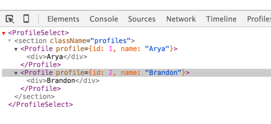

I &lt;3 React!  Seriously, it's great.

    

It mixes really well with ES6, and while it takes a while to understand
the nuances, once you get to grips with it &ndash; even a little &ndash;
it pays off.

Today was a very productive hour, which started with me reluctantly
opening my laptop in bed. I wasn't very excited to carry on after
[last night's fiasco](/articles/devember-02), but I've made up for it today I think.

I've not got a *huge* amount done (just one small commit) but what's
there has lead me to learn a lot about React and ES6.

## Mocking with Lumen

[Lumen](http://lumen.laravel.com) (or rather Laravel, really) allows for very quick mocking of API
in the **app/routes.php** file. I've got a simple API structure up and
running to serve out the data for the user profile selector: 

    $app->group(['prefix' => 'api/profile'], function () use ($app) {
        $app->get('/', function() use($app) {
            return response()->json([
                    'profiles' => [
                        [
                            'id' => 1,
                            'name' => 'Arya'
                        ],
                        [
                            'id' => 2,
                            'name' => 'Brandon'
                        ]
                    ]
                ]);
        });
    });

## Reactive Components

I now have a simple component structure set up in react, and I'm
rendering my profile selector like so:

    // Bloon/ProfileSelect.jsx
    import React from 'react';
    import $ from 'jquery';
    import Profile from './Profile';

    class ProfileSelect extends React.Component {

        /**
         * ProfileSelect Constructor
         */
        constructor(props) {
            super(props)
            this.mounted = false;
            this.state = { profiles: [] };
        }

        /**
         * componentDidMount event handler - fetches
         * the component state via AJAX
         */
        componentDidMount() {
            this.mounted = true;
            Promise.resolve(
                $.get('/api/profile/')
            )
            .then(function(data) {
                if (this.mounted === true) {
                    this.setState({
                        profiles: data.profiles
                    })
                }
            }.bind(this))
            .catch(function(err) {
                console.log(err);
            });
        }

        /**
         * componentWillUnmount event handler
         */
        componentWillUnmount() {
            this.state = {};
            this.mounted = false;
        }

        /**
         * render handler
         */
        render() {
            return (
                <section className="profiles">{
                    this.state.profiles.map(profile => <Profile key={profile.id} profile={profile} />)
                }
                </section>
            )
        }
    }

    export default ProfileSelect;

In the above snippet, we consume our API method and keep
track of our component mount state. This means our
component state is handled asynchronously and allows it
to re-render cleanly whenever the AJAX returns.

I'm not sure how efficient this is in the long term, I'll need
to investigate ways to streamline the access of the data from
our PHP backend to React.

The thing I was most excited to discover is in our render function:

    render() {
        return (
            <section className="profiles">{
                this.state.profiles.map(profile => <Profile key={profile.id} profile={profile} />)
            }
            </section>
        )
    }

    
    *Tasty!*

This is just *beautiful* to me. In short, we render our
component as an HTML section element, and inside it
we map each of the profiles returning a Profile component.

We do this so cleanly using [ES6 arrow functions](https://strongloop.com/strongblog/an-introduction-to-javascript-es6-arrow-functions/)

And our Profile component looks like this:

    // Bloon/Profile.jsx
    import React from 'react';

    class Profile extends React.Component {
        render() {
            return 
{this.props.profile.name}

        }
    }

    export default Profile;

In Chrome, using [React Developer Tools](https://chrome.google.com/webstore/detail/react-developer-tools/fmkadmapgofadopljbjfkapdkoienihi?hl=en), we can can see our React
components in the virtual DOM:

It's onwards and upwards from here. I'll flesh out the UI in the
days to come which will give me a chance to mock the rest of the API.
Following that I'll go back and fill in the gaps of the API and then
finalise the functionality.

## Today's Observations

 - React and ES6 seem to work well but there's lots of room for
  improvement, this is apparent to me after only a few hours.
 - Also, on React, I think they should take a leaf out of Meteor's
  books in terms of allowing more tightly coupled data bindings
  with a backend API
 - Shoutout to [Browserify](http://browserify.org/) and [Babelify](https://github.com/babel/babelify)
  for making everything so easy! Starting to really appreciate its benefit now.
 - Need to think about how to speed up build time with gulp. Hmm.
 - Stats for today: 1 commit, time spent 1h 17m 28s
