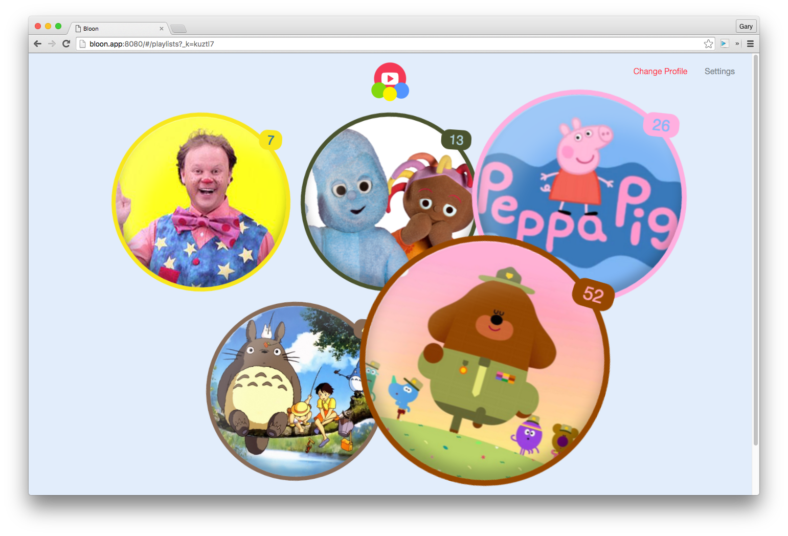
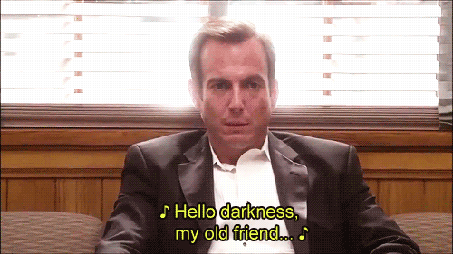

Something lighter today. Well, some quick cleanup of some of the JSX, but following that I toyed with the UI of the playlists view.

    

I've mocked up some playlists on the server side, which now gets served to the client. Depending on the size of the playlist, a weight is assigned to the "bubble" which is rendered. This then determines the size and animation qualities.

This looks OK right now, but when it gets closer to the end of the project, I'll be amending the animation to be more realistic, have more variety per bubble and to have the weight based on other attributes such as age and popularity of the user.

Tomorrow I'll be working on one of the things I'm anticipating being a pain and something I'm dreading, Google's YouTube Embed player. This will probably take up my focus for the next week.

    
    *Yay, Google APIs*

## Today's Observations

 - Working with animations in the browser directly isn't the most fun, I wish there was a more flexible framework for writing powerful animations with complex behavious (e.g. altering the animation behaviour for various states)
 - Stats for today: 2 commits, time spent: 2h 16m