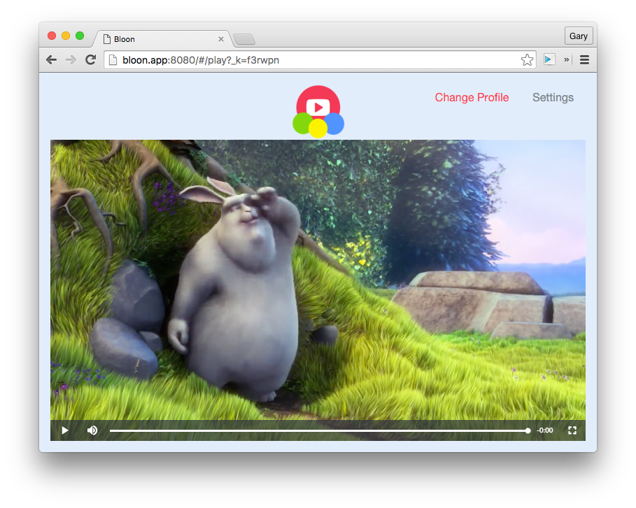

I &lt;3 Flexbox.

    

I've been able to use it a little more tonight. I've been aware of it for a while and have tinkered with it, but today I've tried to delve a little deeper into it. It was a breeze to set up a responsive "full screen" player interface with just a few CSS properties.

I'm not sure if it's just me but I find the naming conventions a little dense and I feel it'll take a while to properly master it (as with all things presentation with HTML/CSS!)

I also played around with [VideoJS](http://videojs.com/) today and I'm looking forward to integrating with this player for serving out my videos. There's a plugin called [videojs-youtube](https://github.com/eXon/videojs-youtube) which handles playing of external videos. Provided I can get this set up, hopefully I'll not have to touch the YouTube API itself (except for the data API for search later on) and maybe have a bit more control over how I display videos.

    
    *Well, that was a freebie!*

We'll see!

## Today's Observations

 - About 1 week now until I break for Christmas. This usually means a last minute rush at work to get everything prepared for when I'm not there, hopefully I'm still able to get an hour or two in.
 - Being off work for a while should (in theory) give me a lot more time to work on the project. However, I'm hoping to not be spending every day of my vacation programming, so still aiming for 1-2 hrs per day!
 - Days I'm thinking will be a challenge: Xmas Day, New Years Eve, New Years Day. We'll see how it goes!
 - Stats for today: 1 commit, time spent: 2h 8m 29s