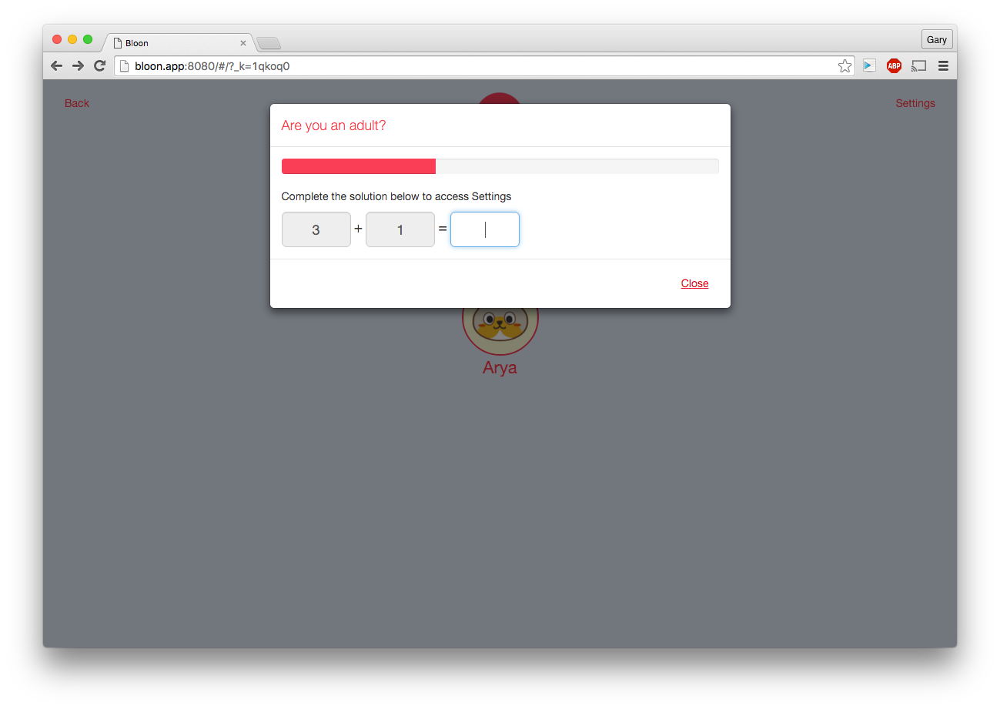

11 days to go!  I feel like I'm very close to a working prototype.

In fact, I could begin testing now if I spent some time fetching some data from YouTube to populate my database. But I think that would be a waste of time right now.

Besides, I spent some time getting the parent interface set up. I have, what I think is a pretty decent parent-protection dialog. It's something that's included in a lot of child-oriented apps. Basically, some how to stop the child from accidentally accessing the settings panel and breaking stuff. Usually this is done by a simple maths problem (I'll be replacing this with TouchID in the final native version).

One thing I've found frustrating, as a parent, is that often our daughter will get stuck with the app prompting her to solve a maths problem. It's not always obvious to her how to get of that screen, so for my version I've added a 15 second timer that will auto-close the parental control dialog if nothing has happened.

    

This gave me a chance to look at including some very rapidly updating React components. In the screen-shot above, the scrollbar is rendered using the *amazing* [react-bootstrap](https://react-bootstrap.github.io/) project1 and its progress amount is calculated inside a timer, updating every 100ms. React doesn't flinch and the component updates smoothly.

    this.countdownInterval = setInterval(() => {
        if (this.state.timeBeforeClosesNow > 0) {
            this.setState({ timeBeforeClosesNow: (this.state.timeBeforeClosesNow-100) })
        } else if (this.state.timeBeforeClosesNow <= 0) {
            this.hideModal();
        }
    }, 100);

    // ...

    <ProgressBar now={this.state.timeBeforeClosesNow/this.state.timeBeforeClosesMax*100} />

Too smooth!

    

--
  1. Unfortunately I've had to roll back my project to Twitter Bootstrap 3.x as the react-bootstrap package doesn't support 4.x yet. Not a biggie, and understandable. But still, I would've *loved* to see it working with the new Bootstrap alpha.

## Today's Observations

 - Seriously, [this is too awesome](https://react-bootstrap.github.io/components.html#forms):  
        <Input
         type="text"
         value={this.state.value}
         placeholder="Enter text"
         label="Working example with validation"
         help="Validation is based on string length."
         bsStyle={this.validationState()}
         hasFeedback
         ref="input"
         groupClassName="group-class"
         labelClassName="label-class"
         onChange={this.handleChange} />

 - One full day left in work until Christmas break! I'm still unsure whether that means more or less time on the project.
 - Stats for today: 3 commits, time spent: 3h 27m 51s