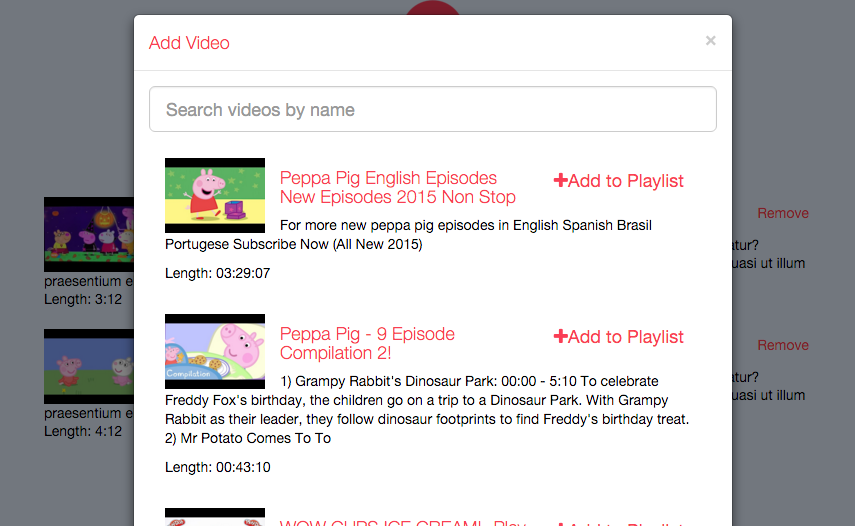

Final stretch.

We now have a simple interface to the YouTube search API. Which, as it happens, is horrendously slow! I'm not going to worry too much about the performance for now, but it's going to be immediately impossible to use, so I need to look into how I can make this more efficient.

    

The UI needs working on, and it needs to be hooked up to the playlist management API, but it's getting there.

Once we have a way to add and remove videos, playlists and profiles, the only things left are to do with authentication.

My goal now is to simply get the prototype of this working locally, and so authentication will be the last thing (probably after the new year and after Devember entirely.)

I probably have another 4-8 hours of solid work left until I have a working version. Just 3 more days left!

## Today's Observations

 
 - Stats for today: 1 commit, time spent 5h 25m 21s