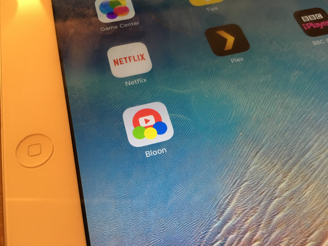

Right on time! My prototype is basically done.

    

OK so it's very early stages, and there's a few features that got jettisoned on the way &ndash; but we're there, effectively.

I've got 2 more #Devember days to polish some things and maybe work on the authentication/API side. Right now my API is basically one large `routes.php` file with everything hacked into it. But it's functioning well enough to serve the app right now.

Anyway, I've been setting up some playlists for my daughter to have a look at tomorrow morning when she wakes up, when I'll start some end user testing! :D

I'll know a lot more about the app tomorrow, and I'll have [a longer list of bugs](https://trello.com/b/E0sJf6x3/bloon-devember), I suspect.

    

## Today's Observations

 - iOS web apps are bullshit. More on this in my summary in the New Year. 
 - Stats for today: 3 commits, 1 tag (yay!), time spent 2h 52m 25s