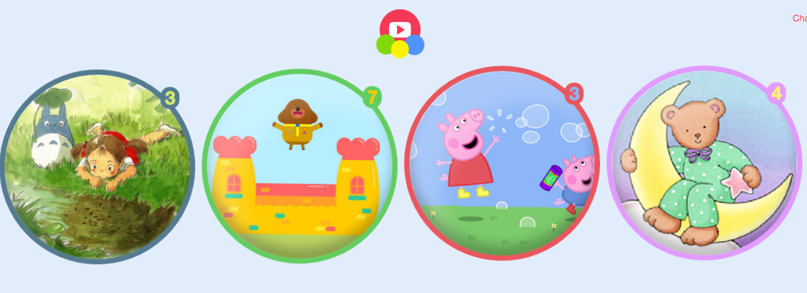

With the prototype working, today was spent performing a bit of testing with my first user, my 2 year old daughter, Arya.

She was excited to use the app when I pointed it out to her on the home screen, and the user interface was intuitive enough (albeit slow &ndash; again, I'll come back to this later) that she was navigating around and watching her favourite YouTube videos[1] in no time.

We discovered a few bugs and I've fixed those tonight.

With the bugs squashed, it was time to work on adding some customisation of the playlist items.

## Bing API is surprisingly good and the PHP League prove to be invaluable again!

    

I integrated with Bing's Image Search API and the [PHP League's Color Extractor library](https://github.com/thephpleague/color-extractor). This means that all the parent does is choose an image related to the name of the playlist, and Bloon will fetch it, extract some colour information and show this on the interface to the child user.

This was very easy to set up, and while it needs a bit of tweaking, I'm very happy with the results!

    
    *The border and bubble colours shown here are extracted dynamically from the source image shown inside the bubble*

___

  1. It's worth noting just how great it was to have my daughter be able to browse her favourite YouTube videos with complete restriction, knowing she would only get to the ones I had set up. Not only that, but the feeling of having conceived this idea and been able to deliver it in ~30 days, was a great one.

## Today's Observations

 - Stats for today: 4 commits, 1 tag , time spent 4h 44m 48s