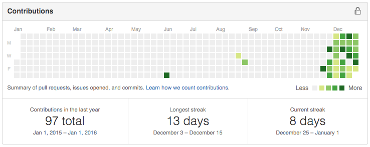

Yesterday I finished #Devember , [a programming challenge](/articles/devember) to code for at least an hour, every night, for 31 days. And to write a blog about it each night.

    <iframe style="display: block; margin: 1em auto;" width="560" height="315" src="https://www.youtube.com/embed/9DCdCoQ49u8" frameborder="0" allowfullscreen></iframe>
    *This is my #Devember*

I succeeded (to some degree; there were some nights I couldn't commit to fully) and came out on the this side of the month with a working prototype for an app called Bloon, a child-friendly YouTube player.

I chose to write the app using React, something which I had no previous experience with. Here's my summary of #Devember, React, other technologies I encountered along the way &ndash; and what's next for Bloon, devblogging and my projects in general.

## Devember

I touched on it in the [previous post](/articles/devember-31), but I'll reiterate it: #Devember was massively rewarding. The idea isn't new or exclusive to the month of December. Also my day job *is* programming, so the idea of writing code pretty much daily isn't the revolutionary aspect &ndash; although it's worth noting that it's difficult to find time and energy to write code *every single day* including weekends, especially with other commitments. And on at least two occasions, I wasn't able to write a line of code.

The biggest thing[1] that kept me going was the idea devblogging in general, something I hadn't done before. Even though I knew it was without an audience, there's still a level of commitment, you don't want to stop posting after you've publicly vowed to do an hour a day at least.

And for that reason, I found a new way to avoid procrastination. This is also helped by only coding in short bursts and of course being able to work on something you thought up, and so your motivation is still pretty high. But still, on those days when you're extra tired, maybe a little drunk or otherwise distracted, you still have to write that blog post. And you still have to make a commit. So, yeah, some days are not as productive and the quality of the code isn't as good, but still, you make a commit.

Blogging every night also keeps you focused and helps you plan your next step &ndash; similar to the benefits of standup meetings. Or in my case, decide what you're going to drop because you realise there isn't enough time. And some features *did* get jettisoned part-way though, but I was able to deliver the prototype I wanted to from day one, more-or-less.

Here's some stats from my journey:

### GitHub Commit Chart

### Time Logged in December (minutes)

<canvas id="chart-time-logged" width="960" style="max-width: 100%; height: 200px; min-height: 100px;"></canvas>

 - Total time spent: <noscript>59.48</noscript> hrs
 - Avg. time spent per day: <noscript>1.92</noscript> hrs
____

1. The other big motivating factor was watching my commit streak on GitHub grow, however I was only really able to achieve a 13-day maximum streak in the entire period, simply because I would go 24 hours without coding in some cases (committing my work at 2am the next morning, on most&ndash;but not all&ndash; nights)

## Individual Technology Thoughts

### Gulp vs Grunt

 - I use Grunt in my day job, but Gulp was chosen for this project
 - Gulp seems faster, but Grunt fits my workflow more &ndash; will probably go with Gulp and seek tools that meet my workflow

### Lumen/Laravel

 - Lumen is pointless for me, Laravel is superior &ndash; even as a microframework &ndash; however I should have used a much lighter framework for knocking up APIs than what I went with (maybe something Node based)

### React

 - No previous experience with React, and my first week was spent banging my head against the desk trying to understand React, the tutorials and documentation, the community suggestions, Flux (and associated frameworks) and other topics.
 - However, I'm *so* glad to have found it, will explore it in more detail on other projects I hope &ndash; next up: React Native

### React-Bootstrap

 - Huge time saver, can't wait for it to update to Bootstrap 4

### Sass vs Less

 - Again, I use Less in my day job but chose Sass for this project
 - Not that much difference for me, similar features available in both. Would be happy to use either, although do prefer syntax of LESS

### Browserify and ES6

 - Browserify is great and I'm glad to get some experience in ES6
 - Love the ES6 features and hope I can keep on using them in other projects

### Safari Mobile Web Apps

 - Not worth bothering with! Too slow, too restrictive and not customisable enough - native apps are the clear winners and Apple clearly wants to keep it this way
 - With that said I was able to launch a working prototype in ~<noscript>59</noscript> hours, which can be useful, especially for the purpose of designing the API

## What's Next?

 - For Bloon, a native (or hybrid) app. Will look at making the API quicker and making some smaller changes to the front-end for the short term
 - The ultimate goal is to release the app to market by June/July
 - Will I continue to code an extra 1 hour (or more) per day? Maybe on average, but I won't be forcing myself to a daily commitment like I have been. However, I will try and do 1 devblog per week to keep my motivation up.
 - One thing's for sure, I'll be keeping up with ES6+Browserify+React as that is the most existing thing to come out of this entire thing for me.