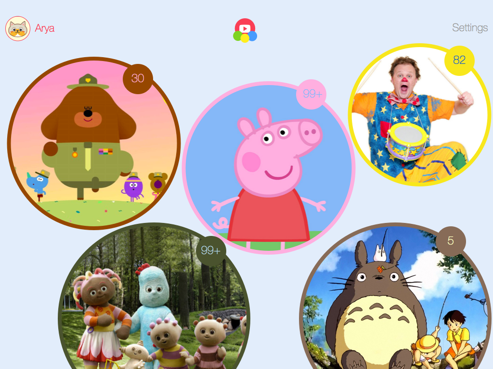

So, I'll be doing [#Devember](http://devember.org/) this year for the first time. What's Devember?

> Devember is a challenge you take up. It is an excuse for programming, for learning to code and for sharing it.

The rules are simple: **write code on a project every day in December.** There's some extra bits about it being
publicly accessible and doing a daily dev blog &ndash; I'll do my best to adhere to these but honestly I'll
be happy to simply write a commit every day.

My personal goals for Devember are:

  1. Explore some technologies on my list that I've not given myself time to
  2. Force me to continue work on a project I've been meaning to do in my spare time for a while
  3. Enable me to write about programming on my blog more often

## The Project

The project is a toddler-friendly YouTube app I've had on my list for a while. It's called **Bloon** and it
looks&ndash;or will look&ndash;like this:

The idea is that parents create playlists for their toddler to browse in a child-friendly user interface
with minimal clutter and simple interface elements. They "pop" a baloon of their favourite character
and off they go!

The goal is ultimately to release this as a native app on iOS and Android, but for the first iteration
I'll be writing it as an in-browser only experience.

## The Methodology

I don't anticipate having anything near a working prototype by the end of December, but I hope I'll to be
most of the way there for my first version.

I'll be writing the web version in PHP using [Lumen](http://lumen.laravel.com/) to serve the API,
with a MySQL database and [React](https://facebook.github.io/react/) to handle handle rendering of the UI.

I'm familiar with Laravel and MySQL but not Lumen or React with only minimal experience. So this will be
a great opportunity to explore these areas.

The development stack will look something like this:

  - **Server Infrastructure:** Ubuntu + Vagrant + nginx
  - **Backend:** PHP + Lumen + MySQL
  - **Frontend:** Twitter Bootstrap + LESS + React

## Follow My Progress

I'll commit my work to [github](https://github.com/gpmcadam) and share information
about my progress as I go on this blog and give a brief summary in the New Year of how everything went.

I've also started [a board on Trello](https://trello.com/b/E0sJf6x3/bloon-devember) to track my progress.

I have a busy schedule this month, my guess is December is the most social month, even for hermits like me! So
I'm anticipating there'll be some days where doing an hour of programming will be ... difficult. I'll share that, too.

You can track my progress here, and in byte-sized snippets on [Twitter](https://twitter.com/gpmcadam)

Also, here's the silly contract you're meant to stick on your announcement:

> I, Gary McAdam, will participate to the next Devember. My Devember will be Bloon (see above). I promise I will program for my Devember for at least an hour, every day of the next December. I will also write a daily public devlog and will make the produced code publicly available on the internet. No matter what, I will keep my promise. 