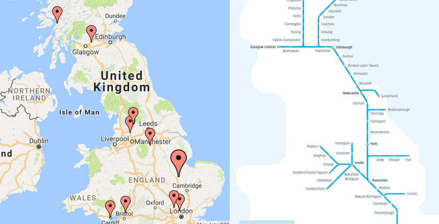

Facebook just suggested a bunch of "People You May Know"
 to me and usually I
can figure out where the suggestions come from (mutual friends, school, work
and recently phone book contacts, which I quickly disabled)

But today, it was different. I had apparently nothing in common with any
of the suggestions.

When looking at each of the profiles to try and figure out a link,
I noticed a bit of a pattern with some of the locations of the people, so
started writing them down and adding them to a map.

Sure enough, I was right. The majority of the locations were destinations
on some of my usual train commutes (trains on the East Coast from Glasgow
to London Kings Cross).

    

Could Facebook be suggesting friends based on sharing train wifi? Can iOS
apps see the SSID you're connected to? Could it be based on GPS location + time?

Weird, Facebook. Really weird.
